# Incident AI Analyzer Presentation Flow

## SmartArt Version

Use this as an 8-box horizontal process in PowerPoint SmartArt or Word.

### Box 1
Incident Created in ServiceNow

Tech stack:
ServiceNow Incident Table

### Box 2
Business Rule Triggers Webhook

Tech stack:
ServiceNow Business Rule
System Property

### Box 3
Webhook Received Locally

Tech stack:
ngrok
Python
Flask

### Box 4
Fetch Full Incident Details

Tech stack:
ServiceNow REST API
requests
ServiceNowClient

### Box 5
Collect Splunk Evidence

Tech stack:
Splunk REST API
SplunkClient
Identifier search
Fallback similarity search

### Box 6
Generate AI Analysis

Tech stack:
Mock KB context
LangChain
ChatNVIDIA
NVIDIA AI Endpoints
openai/gpt-oss-120b

### Box 7
Apply Guardrails and Deduplication

Tech stack:
Low-signal detection
Manual review fallback
Confidence thresholds
analyzed_incidents.json cache

### Box 8
Write Back to ServiceNow

Tech stack:
Comments API
Work Notes API
Attachment API
Assignment Group update
Optional closure

## One-Line Flow

ServiceNow Incident -> Business Rule -> ngrok/Flask Webhook -> Fetch Incident -> Splunk Evidence -> LLM Analysis -> Guardrails and Deduplication -> Comment, Evidence, Reassignment

## Presenter Version

1. A new incident is created in ServiceNow.
2. A ServiceNow Business Rule sends the event to the local webhook URL.
3. The Python Flask receiver accepts the webhook through ngrok.
4. The app fetches the full incident from ServiceNow for complete context.
5. Splunk evidence is searched using identifiers like request ID, quote number, application, and service name.
6. The LLM combines incident details, KB context, and Splunk evidence to generate category, root cause, resolution steps, and routing guidance.
7. Guardrails reduce bad outputs by forcing manual review for low-signal tickets and skipping duplicate comments using cache.
8. The result is written back to ServiceNow as AI comments, evidence work notes, attachments, and confidence-based reassignment.

## Legend

- Rectangle: process step
- Diamond: decision point
- Cylinder: stored data or cache
- Dashed meaning in slides: optional or conditional action

## Suggested Icons

- ServiceNow: ticket or ITSM icon
- Business Rule: lightning bolt or trigger icon
- ngrok/Flask: webhook or API icon
- Splunk: logs or search icon
- LLM: AI brain icon
- Guardrails: shield icon
- Cache/Logs: database icon
- Write-back: comment or sync icon

## Slide Caption

Real-time incident automation flow: ServiceNow triggers the webhook, the Python service enriches the incident with Splunk and KB context, the LLM analyzes it, and guarded automation writes recommendations back to ServiceNow.

## Mermaid Source

```mermaid
flowchart LR
    A[Incident Created<br/>ServiceNow Incident Table]
    B[Business Rule Trigger<br/>ServiceNow Business Rule + System Property]
    C[Webhook Received<br/>ngrok + Python Flask]
    D[Fetch Incident Details<br/>ServiceNow REST API + requests]
    E[Collect Splunk Evidence<br/>SplunkClient + Splunk REST API]
    F[Generate AI Analysis<br/>Mock KB + LangChain + ChatNVIDIA]
    G[Guardrails and Deduplication<br/>Low Signal Check + Cache]
    H[Write Back to ServiceNow<br/>Comments + Work Notes + Attachments + Reassignment]

    A --> B --> C --> D --> E --> F --> G --> H
```

