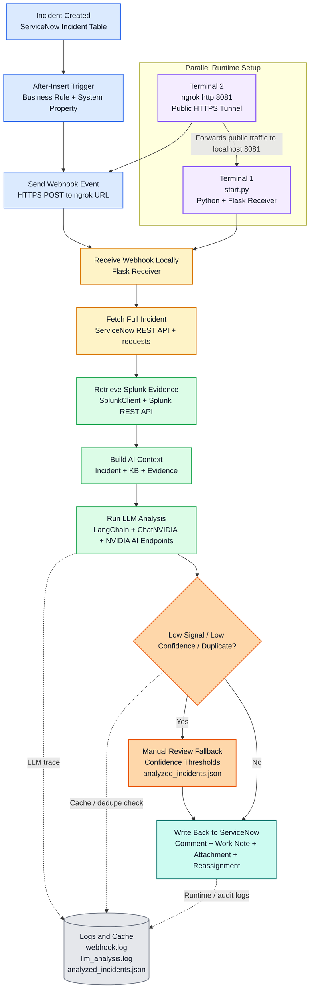

# Top-Down Presentation Flow

## Best Use

Use this version when you want a vertical infographic for PowerPoint or Word with clear color coding and an explicit parallel-runtime section.

## Design Intent

- Top to bottom reading order
- Parallel startup layer at the top
- Main execution path in the center
- Supporting systems shown as side-linked dependencies
- Color-coded zones for easier storytelling

## Color Legend

- Blue: ServiceNow source and trigger layer
- Yellow: Local runtime and network path
- Green: External enrichment and intelligence
- Orange: Guardrails, confidence logic, and deduplication
- Teal: ServiceNow write-back and business action
- Gray: Logs, cache, and persistent artifacts
- Purple border: Parallel processes or always-on runtime pieces

## PPT Box Order

### Parallel Layer
1. Terminal 1: `start.py`
2. Terminal 2: `ngrok http 8081`

These two run in parallel.

### Main Vertical Flow
3. Incident Created in ServiceNow
4. Business Rule Reads Webhook URL
5. ServiceNow Sends HTTPS Event to ngrok
6. ngrok Forwards Request to Flask Receiver
7. Fetch Full Incident from ServiceNow
8. Search Splunk for Evidence
9. Build AI Context with KB + Evidence
10. Run LLM Analysis
11. Apply Guardrails and Deduplication
12. Post Comment / Evidence / Reassignment back to ServiceNow

## Presenter Notes

- Start by calling out that two local runtime components must be running together: the Python webhook receiver and the ngrok tunnel.
- Then explain that ServiceNow only talks to the public ngrok URL, while ngrok forwards that traffic into the local Flask app.
- After the receiver gets the event, the processing becomes sequential: fetch incident, search Splunk, generate AI analysis, apply guardrails, and write back to ServiceNow.
- Emphasize that guardrails prevent risky automation on low-signal or duplicate incidents.

## Mermaid Source

## Short Caption

Two local processes run in parallel: the Flask webhook receiver and the ngrok tunnel. ServiceNow sends incident events to ngrok, ngrok forwards them to Flask, and the application then enriches, analyzes, guards, and writes the result back into ServiceNow.

## Slide Footer

Implementation stack:
ServiceNow, Business Rule, System Property, ngrok, Python, Flask, requests, Splunk, LangChain, ChatNVIDIA, NVIDIA AI Endpoints
